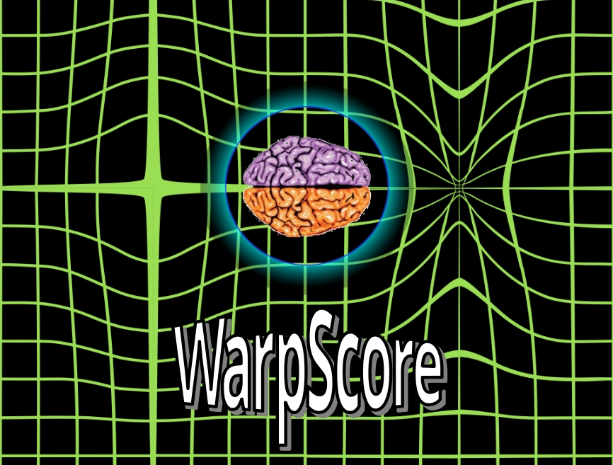

  

<!--WarpScore "Logo".-->

# *WarpScore-Pro*

## Overview
*WarpScore* is a neuropsychological test scoring system that employs free, open-source software that can be independently scrutinized, incrementally improved, and adapted to the needs of individual patients and practice settings. *WarpScore* allows efficient incorporation and selection of digitized normative data both from local clinical and published sources. It provides a framework to develop and efficiently implement a wide variety of clinically-relevant statistical computations and generate customized data summaries (e.g. tables, figures) for use in reports. *WarpScore* encourages practice innovation by facilitating efficient implementation of known and trusted scoring methodologies alongside novel procedures. This allows neuropsychologists to critically evaluate and build confidence in the latter, while simultaneously highlighting limitations of the former.

*WarpScore-Pro* is a basic, flexible implementation of *WarpScore* that forms the basis of a repository created to facilitate sharing and feedback-informed future iterations of the system. *WarpScore-Pro* employs [R Markdown](https://rmarkdown.rstudio.com/) to create individual HTML-based patient reports.

## Limitations
The user assumes all risk for using any code that is provided, which is offered entirely without warranty of any kind. Ethically, legally, and philosophically, there is no software that can replace human clinical judgment.

## Licensing
*WarpScore* 
Copyleft (C) 2026 Bryce P Mulligan, PhD, CPsych | 
Licensed under the GNU General Public License (GPL). See LICENSE for details.

*WarpScore* logo is a modified version of original image by Д.Ильин: vectorization - Star Trek Warp Field.png by Trekky0623 at English Wikipedia, CC0, https://commons.wikimedia.org/w/index.php?curid=102959289
